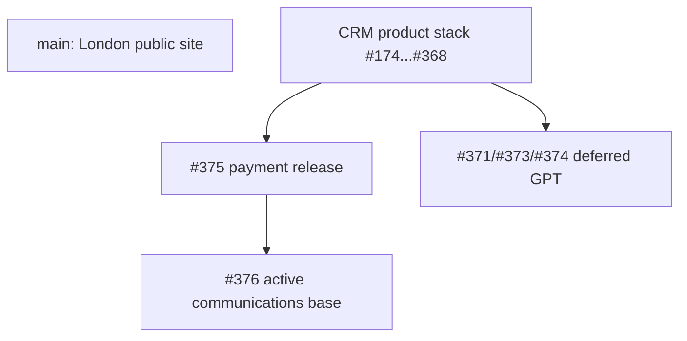

# Open PR inventory and cleanup manifest

Snapshot: 2026-08-19, after the first bounded cleanup pass.

This is a repository-governance record, not runtime evidence. GitHub PR metadata,
exact Git ancestry and Actions evidence take precedence over this document.

## Snapshot

- Default branch: `main` at `a2f7078db4050b8f2985cb991a45ebae1b4512b1`.
- Open PRs at inspection start: 159, of which 156 were Draft.
- Open PRs after the first cleanup pass: 105, all Draft.
- No PR was merged. No branch was deleted or force-pushed.
- `main` is the London public-site lineage. It does **not** contain the CRM tree
  (`supabase/` is absent there), so it is not the current canonical CRM product
  source.

## Category legend

| Category | Meaning | Default action |
| --- | --- | --- |
| A. ACTIVE PRODUCT | Current product head or protected base for active work | Do not move, merge, rebase or close |
| C. INTENTIONALLY DEFERRED | Deliberately paused product work | Keep Draft and restack only in a dedicated workstream |
| D. HISTORICAL / REFERENCE | Deployed, parallel, rollback or migration-lineage record | Keep branch; do not merge by default |
| F. RELEASE / RC / VALIDATION | Exact-head release candidate retained because its source is still a stack base | Never merge; close only after it is no longer a dependency |
| I. BLOCKED / UNKNOWN | Work has a concrete unresolved external or lineage dependency | Do not guess or mutate |

## Active and deferred heads

| PR | Category | Base -> head | Active dependency | Production relevance | Action |
| --- | --- | --- | --- | --- | --- |
| #375 Monzo payment destinations | A | `agent/monzo-multiple-sessions-for-artists-v2` `908a1d8` -> `agent/monzo-payment-destinations-production` `4369efa` | Yes, base of #376 | Current payment release candidate. Exact-head CI and protected production gates succeeded on 2026-08-19. | Do not touch in this workstream. |
| #376 Cloudflare MCP code navigation | A | #375 `4369efa` -> `agent/cloudflare-mcp-code-navigation` `214fdd0` | Yes, protected base of the active communications/Instagram workstream | Documentation/agent instruction only; exact-head CI green. | **DO NOT TOUCH.** |
| #377 unified GPT onboarding skill | C | #376 `214fdd0` -> `agent/gpt-unified-production-onboarding-skill` `c715066` | No product child, but paired with deferred unified GPT work | Docs only; exact-head CI green. | Keep Draft until unified GPT resumes. |
| #371 GPT Monzo reconciliation | C | #368 `908a1d8` -> `agent/gpt-monzo-reconciliation-v2` `7ed9ab9` | Base of #373 | Reserves migration `0066`, which collides with the payment release's renumbered `0066`. | Keep Draft; no merge or rebase. |
| #373 reusable Monzo catalogue, original stack | C | #371 `7ed9ab9` -> `claude/vishar-monzo-deposits-refactor-r0wvn8` `aab2708` | Base of #374 | Original payment/GPT combination, migrations `0067` and `0068`. | Keep as restack reference only. |
| #374 unified user-context GPT | C | #373 `aab2708` -> `agent/gpt-unified-user-context` `fb32a7d` | Paused unified GPT head | Owns migration `0069`; no production/OAuth action is included. | Keep Draft; explicitly deferred. |
| #306 WhatsApp runtime reconcile | I | #308 `dc72278` -> `agent/whatsapp-production-runtime-reconcile` `e98a71e` | No active child | CRM Pages rollout and boundary audit succeeded, but Meta identity verification blocks Vladimir Embedded Signup and any later drain activation. | Keep Draft. Resume only after Meta resolves the external verification. |

The active Instagram/provider-neutral work has no separately pushed remote branch
at this snapshot. Its declared base, `agent/cloudflare-mcp-code-navigation`
(#376), was neither moved nor changed.

## Retained release candidates

These are release/RC records, not merge candidates. They remain open only because
the unmerged CRM graph still references their branches.

| PRs | Category | Reason | Action |
| --- | --- | --- | --- |
| #248, #254 | F | RC20/RC21 exact-release records remain below the current CRM ancestry. | Preserve branch and PR until CRM history is canonicalized. |
| #259, #263 | F | RC24/RC25 WhatsApp assembly records are bases for later GPT/Monzo branches. | Preserve; never merge as release PRs. |
| #285, #288 | F | RC30/RC31 WhatsApp rollout records precede the later #306 reconciliation. | Preserve for rollback/reference; no new rollout from them. |

## Historical and reference inventory

Every remaining PR not listed above is category D. The lists below are exhaustive
for this snapshot; therefore each open PR has exactly one primary category.

| Reference group | PRs | Why retained | Recommended action |
| --- | --- | --- | --- |
| Current payment-spine bases | #174, #176-179, #181-182, #184, #189-205, #208, #211, #213-216, #219, #229, #231, #233, #235, #244, #257, #264, #270, #272-273, #278-280, #287, #289, #294, #303-304, #310, #315, #317, #319, #322, #326, #329, #337, #339, #341, #343, #352, #358, #362, #366, #368 | They form the Git ancestry beneath #375. Several represent product changes already released without being merged to `main`. | Freeze: do not merge, rebase, or close while #375/#376 remains the working lineage. |
| Parallel production lineages | #180, #185-187, #228, #250-253, #255, #260-262, #265-269, #271, #276-277, #281, #308-309, #313, #325, #350, #353, #355, #364, #367 | Calendar, Telegram, WhatsApp, Gmail, GPT, payment-route and rollout-documentation branches that are not ancestors of #375 but retain deployed or diagnostic context. | Keep as reference. Reconcile only by a separately validated canonicalization change. |
| Governance record | #378 | This manifest itself, stacked on #375 at `397cb90`; it changes documentation only. | Keep Draft until the canonical product-lineage reconciliation is separately planned. |

### Important reference heads

| PR | Base -> head | Production relevance | Reason it cannot be merged now |
| --- | --- | --- | --- |
| #364 GPT three-action surface | #358 `d3f6b2a` -> `95e7561` | Three Action sets, no migration. | Parallel to #375; merging would require a full product-lineage reconciliation. |
| #367 Gmail shared cron | #325 `9677ee0` -> `cf231f1` | Gmail drain runtime change. | Parallel to #375; requires exact deployed-state reconciliation first. |
| #353 dedicated payment host | #350 `16fb73d` -> `2fa7342` | Payment-route recovery lineage. | Parallel route history; later releases supersede parts of it. |
| #355 RC67 rollout record | `main` `a2f7078` -> `0a30195` | Documentation only. | Retain as a rollout record, not a product merge. |
| #309 CRM Pages production target fix | #304 `5d5aef3` -> `baf1a37` | Corrected Pages production-target deploy completed. | Deployed hotfix on a parallel lineage. |
| #313 OAuth consent restore | RC35 `baf1a37` -> `089310f` | Historic private-CRM hotfix. | Exact relationship to later OAuth branches must be reconciled before closure. |

## Migration ownership and collision map

The current migration lineage is not safe for arbitrary merging. Ownership that
matters for future reconciliation is:

| Range | Owning PRs / lineage |
| --- | --- |
| `0001`-`0014` | #176 CRM and durable booking foundation |
| `0015`-`0025` | #177 multi-artist/payments foundation |
| `0026`-`0045` | Calendar, GPT, Telegram, Team, manual intake, availability and first Monzo spine (#178, #179-182, #184-185, #189, #191, #193, #195, #200-203, #233) |
| `0046`-`0052` | WhatsApp / record-editing product line; old parallel branches use different historical filenames around `0048`-`0050`, so use the final RC lineage, not filename guesses |
| `0053`-`0059` | GPT reads/full management, duration tiers, reconciliation review and Gmail (#287, #294, #303, #322, #325) |
| `0060`-`0065` | Monzo route recovery, project status, archival, tier links, second-artist readiness and multiple sessions (#329, #326, #352, #358, #366, #368) |
| `0066`-`0067` | #375 payment destination catalogue and project deposit policy, deployed payment-only release |
| `0066` / `0067`-`0069` | Deferred GPT stack: #371 claims `0066`; #373 claims `0067`/`0068`; #374 claims `0069` |

The last two rows are a deliberate collision boundary. No merge, rebase, or
migration renumbering belongs in housekeeping.

## Closed in this cleanup pass

Closed without merge, branches retained:

- Validation/diagnostic: #183, #188, #234, #241, #275, #284, #286, #292, #296, #298, #300, #302.
- One-time operator/provisioning/recovery: #242, #243, #274, #282, #283, #290, #291, #293, #295, #297, #299, #301.
- Release/RC operator: #249, #256, #258, #268, #307, #312, #314, #316, #318, #320, #323, #324, #330, #332-336, #338, #340, #342, #344-345, #348, #351, #354, #359, #369-370.
- Historical documentation: #160.

Each closed PR had no remaining open child at the time of closure, or was an
operator-only leaf whose completed/superseded outcome is recorded in its PR.

## Why `main` stopped reflecting the product

CRM product work was deployed from protected exact-head release branches while
the underlying stacked product PRs stayed Draft. Later product work therefore
continued from those Draft heads rather than from `main`. The result is that
production evidence exists, but the default branch does not contain a single
reconciled CRM source tree.

## Merge decision

There are no safe merge candidates in this pass. In particular, merging #375
into its current non-default base would not make `main` canonical, while merging
the full CRM graph directly into `main` is a separate product-lineage
reconciliation that needs fresh production tree, migration and CI proof.

## Minimal policy going forward

1. A product PR stays open only while it is active or is a declared base of an
   active stack. Record the exact head in its body.
2. Cut a release/validation/operator PR from one exact product SHA. Close it
   immediately after success, cancellation, or supersession; keep its branch.
3. Close superseded Drafts once their replacement is named and Git ancestry is
   checked. Do not use Draft as an archive.
4. Before deploying a product head, state its canonical-history plan: merge to
   `main`, or create one explicitly named reconciliation PR afterwards.
5. Reserve migrations in one visible table before parallel work starts. A
   release branch never owns a migration; the product branch does.
